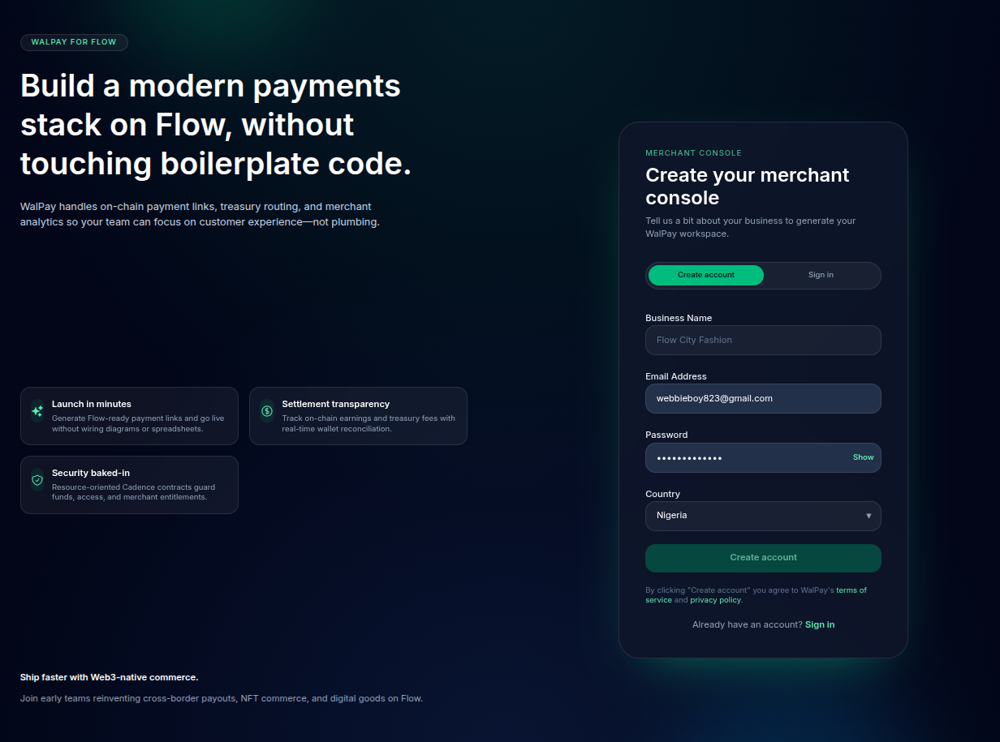

# WalP

WalP is an end-to-end Flow blockchain payment-link platform. It lets on-chain sellers create branded checkout links, route fees to the WalP treasury, and reconcile earnings across web, backend, and Cadence smart-contract layers.

> **Use case:** A merchant without a storefront can spin up a WalP link, share it with a buyer, collect FLOW with a platform fee, and monitor payouts in a single dashboard. The Flow smart contract guarantees that fees and seller earnings are settled atomically while the backend keeps fiat equivalents, images, and email notifications in sync.

## Contents
- [Why it matters](#why-it-matters)
- [System architecture](#system-architecture)
- [Project layout](#project-layout)
- [Quick start](#quick-start)
- [Operational playbook](#operational-playbook)
- [Additional resources](#additional-resources)

## Why it matters
- **Programmable commerce on Flow:** Payment links encapsulate pricing, fee splits, and status directly in Cadence, reducing manual bookkeeping.
- **Seller-friendly onboarding:** Email OTP flows, wallet gating, and responsive dashboards minimize friction for non-technical businesses.
- **Extensible rails:** The backend exposes REST endpoints for partner integrations, while the smart contract exposes read/write points for external Flow wallets.

## System architecture
- **Frontend (`frontend/`)** – React 19 + Vite + Tailwind UI for seller onboarding, payment link management, and public checkout pages. Integrates with Flow through `@onflow/fcl`.
- **Backend (`backend/`)** – Node.js server with a lightweight router, MongoDB persistence, secure session handling, OTP-based auth, and hooks for Flow transaction confirmations.
- **Smart contract (`smart_contract/`)** – Cadence `WalPay` contract that mints payment links, enforces fee distribution, and tracks seller earnings. Includes scripts/transactions for create, pay, and deactivate actions.
- **Docs (`docs/`)** – Architecture notes and decision records. Start with `docs/architecture.md` for sequence diagrams and data flow.

See the [Architecture](docs/architecture.md) document for deep dives into request lifecycles, Cadence resources, and integration touchpoints.

## Project layout
```
.
├── backend/              # REST API, auth, MongoDB models, Flow webhook hooks
├── frontend/             # Seller dashboard + payment pages (React/Vite/Tailwind)
├── smart_contract/       # Cadence contracts, transactions, scripts, tests
├── docs/                 # Additional documentation (architecture, ADRs, etc.)
├── CONTRIBUTING.md
├── LICENSE.md
└── README.md             # You are here
```

## Quick start
Prerequisites:
- Node.js 20+
- pnpm 8+
- MongoDB 6+ running locally or in the cloud
- Flow CLI (`flow`) if you intend to deploy the contract or run the emulator

1. Clone the repository and install dependencies:
   ```bash
   git clone <repo-url> walp
   cd walp
   pnpm install --filter ./frontend
   pnpm install --filter ./backend
   pnpm install --filter ./smart_contract
   ```

2. Configure environment variables (see per-folder READMEs for full tables):
   - `frontend/.env` – `VITE_API_URL`, `VITE_WALPAY_ADDRESS`, etc.
   - `backend/.env` – Mongo/OTP/email credentials, Flow/USD rate, CORS origins.
   - `smart_contract/flow.json` – accounts and deployment targets.

3. Start services in separate terminals:
   ```bash
   # backend API (http://localhost:4000)
   cd backend
   pnpm dev

   # frontend app (http://localhost:5173)
   cd ../frontend
   pnpm dev
   ```

4. (Optional) Flow emulator + contract deployment:
   ```bash
   cd ../smart_contract
   flow emulator start
   flow project deploy --network emulator
   ```

## Operational playbook
- **Onboarding sellers:** Use the Register screen, verify email via OTP, connect a Flow wallet, and create payment links. Backend validates wallet ownership before allowing destructive actions.
- **Fee routing:** Platform fee percentage is configured via `PLATFORM_FEE_PERCENT` (backend) and stored on-chain during contract initialization. Cadence ensures the fee hits `platformTreasury` while net proceeds are deposited to the seller.
- **Reconciliation:** The dashboard fetches `/payments` and `/transactions` for a seller, computes fiat amounts using cached Flow/USD rates, and mirrors the on-chain `getSellerEarnings` script for visibility.
- **Extending on-chain logic:** Modify `cadence/contracts/WalPay.cdc`, regenerate transactions/scripts, and update the frontend `walpay.ts` helpers. Keep ABI compatibility in mind when shipping to mainnet.

## Additional resources
- [Frontend guide](frontend/README.md)
- [Backend guide](backend/README.md)
- [Smart contract guide](smart_contract/README.md)
- [Architecture notes](docs/architecture.md)
- [Contributing](CONTRIBUTING.md)
- [License](LICENSE.md)

Questions or suggestions? Open a discussion or follow the steps in [CONTRIBUTING.md](CONTRIBUTING.md) to file an issue or merge request.
